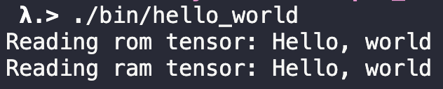

# Requirements

- `clang++` or any compiler that support [`C++11`](https://en.wikipedia.org/wiki/C%2B%2B11)
- `cmake` with version `>= 3.10`

# How to Compile

```bash
$ git clone https://github.com/dboyliao/PyDataTP_2020.git
$ cd PyDataTP_2020 && git submodule update --init
$ mkdir build
$ cd build && cmake -DCMAKE_BUILD_TYPE=Debug ..
$ make hello_world
```

Run `1_hello_world/hello_world` under `build` directory:

